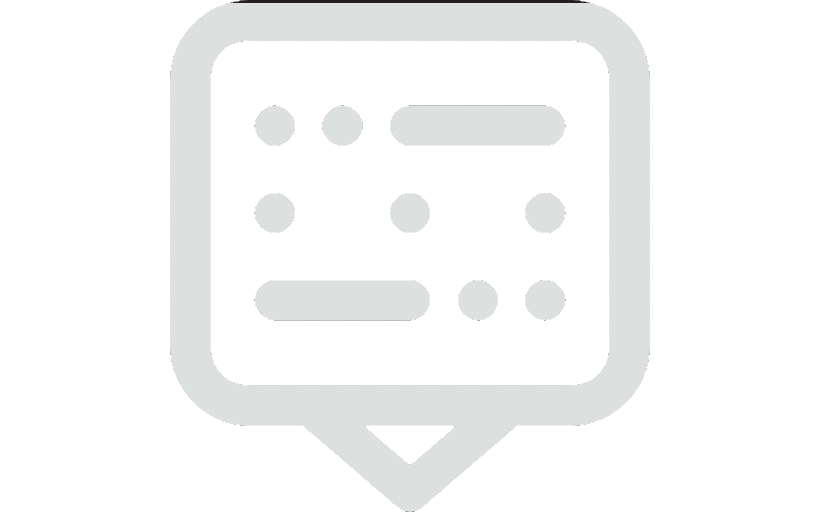

<a name="readme-top"></a>

<div align="center">

  
  <br/>

### MorseCode Message Decoder
Embark on a thrilling Morse code decoding journey with our Ruby project. Discover hidden messages, grasp Ruby syntax, and unveil the mysteries of language cryptography. Unlock Morse code secrets now!

</div>

# 📗 Table of Contents

- [📨 MorseCode Message Decoder](#about-project)
  - [🛠 Built With](#built-with)
    - [Tech Stack](#tech-stack)
    - [Key Features](#key-features)
- [💻 Getting Started](#getting-started)
  - [Prerequisites](#prerequisites)
  - [Setup](#setup)
  - [Run](#run)
- [👥 Authors](#authors)
- [🔭 Future Features](#future-features)
- [🤝 Contributing](#contributing)
- [⭐️ Show your support](#support)
- [🙏 Acknowledgements](#acknowledgements)
- [📝 License](#license)

<div align="center"><hr width="250px"/></div>

# 📨 MorseCode Message Decoder <a name="about-project"></a>

Embark on a thrilling Morse code decoding journey with our Ruby project. Discover hidden messages, grasp Ruby syntax, and unveil the mysteries of language cryptography. Unlock Morse code secrets now!

During your vacation at the seaside, time after time you find old bottles with parchment inside. Out of curiosity, you look into the next bottle and see that there is a message written in Morse code. Your curiosity grows even more - maybe you just found the lost treasure of the pirates! However, you are getting tired of decrypting messages manually. Fortunately, you can program in Ruby and you can help yourself by automating this process.

Let's not waste time, the pirate treasure awaits! Let's get to work.
  
## 🛠 Built With <a name="built-with"></a>

- ### Tech Stack <a name="tech-stack"></a>

  <ul>
    <li>
      <a href="https://www.ruby-lang.org/en/">
      
      Ruby
      </a>
    </li>
  </ul>

<!-- Features -->

- ### Key Features <a name="key-features"></a>

  #### 1️⃣ Method <kbd>decode_char</kbd> to decode a MorseCode `character`.
- Takes a string parameter, and return the corresponding character in uppercase
  - e.g. `decode_char(".-")` returns "A".

  #### 2️⃣ Method <kbd>decode_word</kbd> to decode an entire `word` written in MorseCode.
 - Takes a string parameter, and return the string representation.
 - Every character in a word will be separated by a single space
   - e.g. `decode_word("-- -.--")` returns "MY".

  #### 2️⃣ Method <kbd>decode</kbd> to decode the entire `message` written in MorseCode.
- Takes a string parameter, and return the string representation.
- Every word will be separated by 3 spaces
  - e.g. `decode("-- -.--   -. .- -- .")` returns "MY NAME".

<p align="right">(<a href="#readme-top">back to top</a>)</p>

<!-- LIVE DEMO

## 🚀 Live Demo <a name="live-demo"></a>

> Add a link to your deployed project.

- [Live Demo Link](<replace-with-your-deployment-URL>)

<p align="right">(<a href="#readme-top">back to top</a>)</p>
-->
<!-- GETTING STARTED -->

## 💻 Getting Started <a name="getting-started"></a>

To get a local copy of this project up and running, follow these steps.

- ### Prerequisites

   - In order to run this project locally you need `git` installed. Please got to [Getting Started - Installing Git guide](https://git-scm.com/book/en/v2/Getting-Started-Installing-Git) and follow the steps described for your system to install `git`.
   - Also you must have `Ruby` installed, you can go to the [Installing Ruby](https://www.ruby-lang.org/en/documentation/installation/) documentation and follow the steps for your computer OS.

- ### Setup
    Clone this repository to your desired folder:
    ```sh
    cd my-folder
    git clone git@github.com:luigirazum/ruby-morsecode-decoder.git
    cd ruby-morsecode-decoder
    ```
- ### Run
    In the `ruby-morsecode-decoder` folder, use the following code to run the app
    ```rb
    ruby decoder.rb
    ```

<p align="right">(<a href="#readme-top">back to top</a>)</p>

<!-- AUTHORS -->

## 👥 Author(s) <a name="authors"></a>

👨‍💻 **Luis Zubia**

<ul>
  <li>
      <a href="https://github.com/luigirazum">
      
      Github: <b>@luigirazum</b>
      </a>
    </li>
    <li>
      <a href="https://twitter.com/LuigiRazum">
      
      Twitter: <b>@LuigiRazum</b>
      </a>
    </li>
    <li>
      <a href="https://linkedin.com/in/luiszubia">
      
      LinkedIn: <b>Luis Zubia</b>
      </a>
    </li>
</ul>

<br>

👤 **Misal Azeem**

<ul>
  <li>
      <a href="https://github.com/misalazeem">
      
      Github: <b>@misalazeem</b>
      </a>
    </li>
    <li>
      <a href="https://twitter.com/misal_azeem">
      
      Twitter: <b>@misal_azeem</b>
      </a>
    </li>
    <li>
      <a href="https://linkedin.com/in/misal-azeem/">
      
      LinkedIn: <b>Misal Azeem</b>
      </a>
    </li>
</ul>

<p align="right">(<a href="#readme-top">back to top</a>)</p>

<!-- FUTURE FEATURES -->

## 🔭 Future Features <a name="future-features"></a>

- Add custom message decoding.
- Add special symbols decoding.
- Show the decoded message more colorfully.

<p align="right">(<a href="#readme-top">back to top</a>)</p>

<!-- CONTRIBUTING -->

## 🤝 Contributing <a name="contributing"></a>

Contributions, issues, typos, and feature requests are welcome!

Feel free to check the [issues page](../../issues/).

<p align="right">(<a href="#readme-top">back to top</a>)</p>

<!-- SUPPORT -->

## ⭐️ Show your support <a name="support"></a>

If you like this project, your support giving a ⭐ will be highly appreciated.

<p align="right">(<a href="#readme-top">back to top</a>)</p>

<!-- ACKNOWLEDGEMENTS -->

## 🙏 Acknowledgments <a name="acknowledgements"></a>

- We would like to thank all those people that have helped us to be good programmers.

<p align="right">(<a href="#readme-top">back to top</a>)</p>

<!-- FAQ (optional)

## ❓ FAQ <a name="faq"></a>

> Add at least 2 questions new developers would ask when they decide to use your project.

- **[Question_1]**

  - [Answer_1]

- **[Question_2]**

  - [Answer_2]

<p align="right">(<a href="#readme-top">back to top</a>)</p>
-->
<!-- LICENSE -->

## 📝 License <a name="license"></a>

This project is [MIT](./LICENSE) licensed.

<p align="right">(<a href="#readme-top">back to top</a>)</p>
